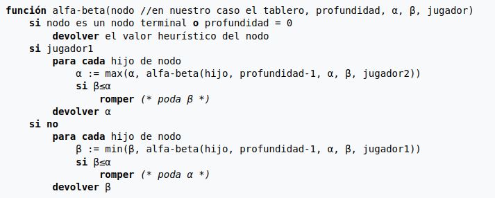
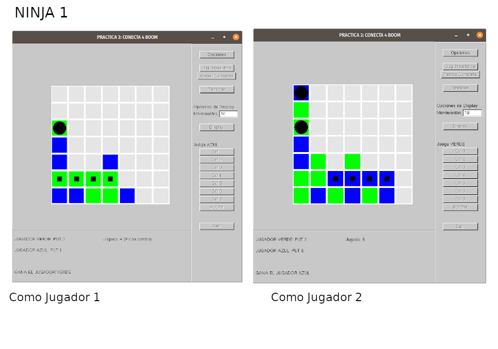
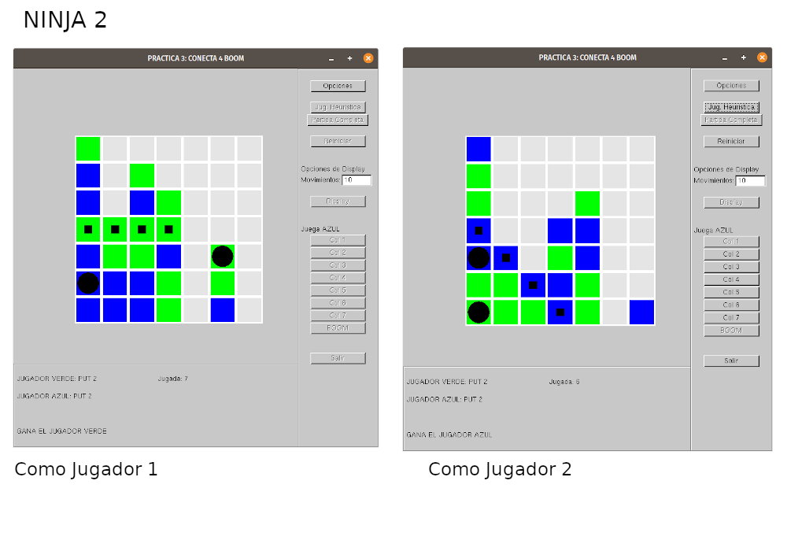
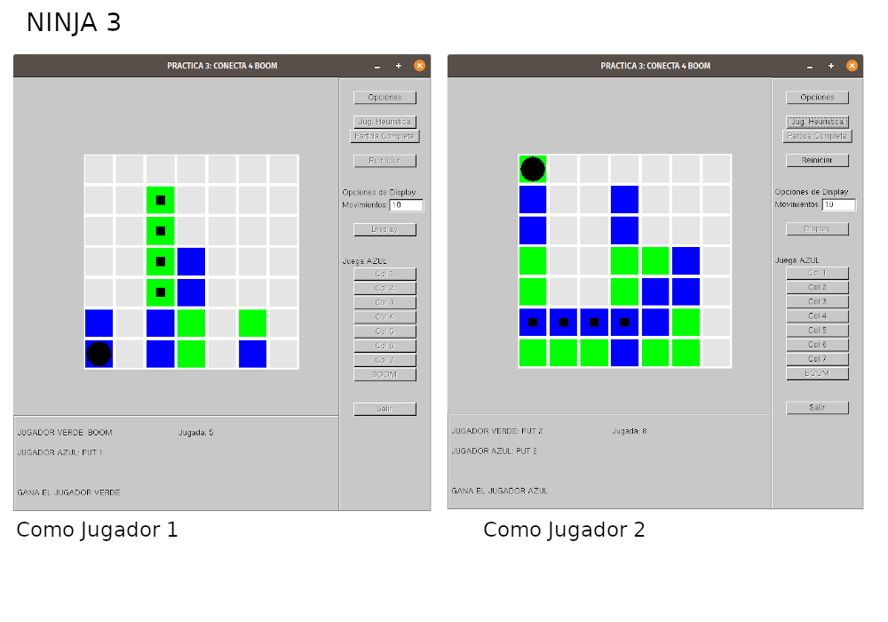

### Memoria Práctica 3 Inteligencia Artificial

###### Salvador Romero Cortés

---

Esta práctica consiste en desarrollar un algoritmo minimax o de poda alfa beta junto con una heurística que sea capaz de ganar a los 3 ninjas del "Conecta 4 BOOM".

En mi caso desarollo el algoritmo de poda alfa-beta, para el cual dispondremos de un límite de 8 niveles de exploración en el árbol. Para implementar el algoritmo partimos del siguiente esquema: 



Además seguiremos la parametrización sugerida por el profesor:

```c++
double Poda_AlfaBeta(Environment act, int player, int depth, Environment::ActionType & accion, double alpha, double beta);
```

Donde `act` es el tablero actual, `player` el jugador, `depth` el nivel de profundidad que se está explorando, `accion` es la acción que realizará el bot y `alpha` y `beta` son los parámetros necesarios para la poda. La función devuelve `alpha` o `beta`  en función del nivel, y por tanto del jugador (max o min).

Para la llamada, inicializamos `alpha` a $-\infty$ y `beta` a $+\infty$.  La acción ha realizar se devuelve por referencia.

La implementación consiste en seguir el esquema anterior. Algunos comentarios:

* Para obtener los nodos hijos usamos `act.GenerateAllMoves(posibles)` donde posibles es un vector de `Environment` que representa los estados hijos del actual.
* La comprobación de si es nodo terminal se hace mediante una comprobación del parámetro `depth` y mediante el método `JuegoTerminado()`. Si el primero es 0 o el segundo es `true`, estaremos frente a un nodo terminal.
* El jugador será el max si coincide con `act.JugadorActivo()`.
* Iterar sobre los hijos consiste en iterar sobre el vector de `posibles`.
* Para devolver la acción tenemos que tener en cuenta varias cosas:
  * Sólo se debe devolver en la raíz, esto es en la primera llamada recursiva (la que se realiza desde `think`, con `depth` 8).
  * Además sólo se debe devolver la acción que haya provocado la actualización del valor alpha o beta. Consideramos la primera iteración como válida en caso de que no encuentre ninguno que sea mayor o menos (según max o min). Esto puede ocurrir si todos los estados tienen el mismo valor heurístico.

Sólo con implementar este algoritmo ya ganamos al ninja 1 siendo tanto jugador 1 como jugador 2. Sin embargo, perdemos contra el resto de ninjas. Necesitamos mejorar la heurística. 

Para ello partimos de la función `Valoracion(const Environment & estado, int jugador)`. Aquí seguimos la misma funcionalidad que `ValoracionTest` sólo que en lugar de llamar a `Puntuacion`, llamamos a `miPuntuacion`. Esta última es la función que determina el valor de un estado no terminal (el juego no ha acabado). 

Por tanto la función Valoracion quedaría así:

```c++
double Valoracion(const Environment &estado, int jugador){
    int ganador = estado.RevisarTablero();

    if (ganador==jugador)
       return 99999999.0; // Gana el jugador que pide la valoracion
    else if (ganador!=0)
            return -99999999.0; // Pierde el jugador que pide la valoracion
    else if (estado.Get_Casillas_Libres()==0)
            return 0;  // Hay un empate global y se ha rellenado completamente el tablero
    else{   //aqui se viene lo interesante
        return miPuntuacion(estado, jugador);
    }
```

Para evaluar un tablero me he basado en 3 factores:

1. Número de fichas y su cercanía al centro del tablero (base de la valoración test)

2. Número de grupos de 2 o 3 fichas adyacentes presentes en las filas.

3. Número de grupos de 2 o 3 fichas adyacentes presentes en las columnas.

Calculando una valoración en función de estos elementos podemos ganar a los tres ninjas siendo jugador 1 y jugador 2.

**Número de fichas cercanas al centro**

Esta valoración es la que utiliza `ValoracionTest` y simplemente calcula el número de fichas del jugador actual y las evalúa en función de su cercanía al centro del tablero.

```c++
for (int i=0; i<7; i++)
      for (int j=0; j<7; j++){
         if (estado.See_Casilla(i,j)==jugador_actual or estado.See_Casilla(i,j)==bomba_actual){
            if (j<3)
               casillas += j;
            else
               casillas += (6-j);
         }
      }
```

**Número de grupos de 2 o 3 fichas adyacentes presentes en las <u>filas</u>**

Para este factor, creamos dos vectores de tamaño 2 que almacenarán la información para un jugador y para el otro. Los vectores son:

```c++
int filas_muybuenas[2] = {0};
int filas_buenas[2] = {0};
```

Donde almacenaremos el número de grupos de 3 fichas adyacentes en `filas_muybuenas` y las de 2 fichas en `filas_buenas`. La posición del vector depende del jugador que estemos evaluando. 

```c++
 for (int i=0; i < 7; i++){
        for (int j=0; j < 7; j++){
            fichas_conexas = 0;
            for (int k=j; k < 7 && (estado.See_Casilla(i,k) == jugador_actual or estado.See_Casilla(i,k) == bomba_actual); k++){
                fichas_conexas++;
                j = k;
            }
            if (fichas_conexas >= 3){
                filas_muybuenas[jugador_actual-1]++;
            } else if (fichas_conexas == 2){
                filas_buenas[jugador_actual-1]++;
            }
        }
    }
```

Donde jugador_actual es una variable que representa el jugador que estemos analizando. En la función evaluamos ambos jugadores, por tanto con hacer: 

```c++
int jugador_opuesto = (jugador + 1 ) % 3 + 1;
jugador_actual = jugador_opuesto;
```

Ya podríamos repetir el código anterior para evaluar las fichas "enemigas". 

A la hora de comprobar usamos tanto `==jugador_actual` como ` ==bomba_actual`, ya que las bombas se representan con un caracter distinto pero puntúan igual a la hora de hacer 4 en raya.

Finalmente, evaluamos con 20 puntos cada grupo de 3 fichas y con 10 los grupos de 2 fichas. Esta valoración es arbitraria y sirve para darle más peso a los grupos de 3 fichas adyacentes. Esta puntuación es negativa cuando se evaluan las del rival.

**Número de grupos de 2 o 3 fichas adyacentes presentes en las <u>columnas</u>**

Esto lo calculamos de manera exáctamente igual que las filas, sólo que ahora nos desplazamos en la matriz según las columnas y no según las filas. 

---

Por tanto, el esquema general de la función de evaluación es:

```
c = evaluar número de fichas en función de la distancia al centro
fi = calcular y evaluar número de filas buenas o muy buenas
co = calcular y evaluar número de columnas buenas o muy buenas
puntuacion += c + fi + co
- - -
fi2 = calcular y evaluar número de filas buenas o muy buenas para el rival
co2 = calcular y evaluar número de columnas buenas o muy buenas para el rival
puntuacion -= fi2 + co2
```

Finalmente, con el algoritmo inicial y esta valoración conseguimos ganar a todos lo ninjas tanto como jugador 1 como jugador 2. Comentar que también quise agregar una comprobación de las diagonales del tablero para intentar ganar en menos movimientos, pero que resultó en cálculos complejos y peores resultados.  Sin embargo, esto no implica que no pueda ganar por diagonales, ya que en muchos casos una diagonal suele implicar una ficha adyacente en una fila o columna (no siempre). Además como calculamos la valoración como una diferencia entre las puntuaciones del jugador y su rival, el bot también frenará lo que considere como bueno para el enemigo.

Con respecto a la bomba, no consideramos nada especifico para esta. Simplemente, si el valor heurístico del estado siguiente de explotarlo es favorable lo seguirá.

Algunas capturas de las victorias:





